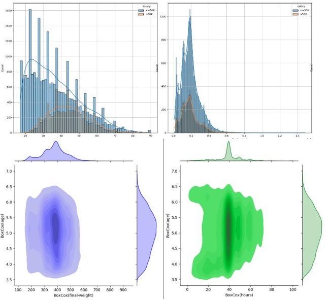
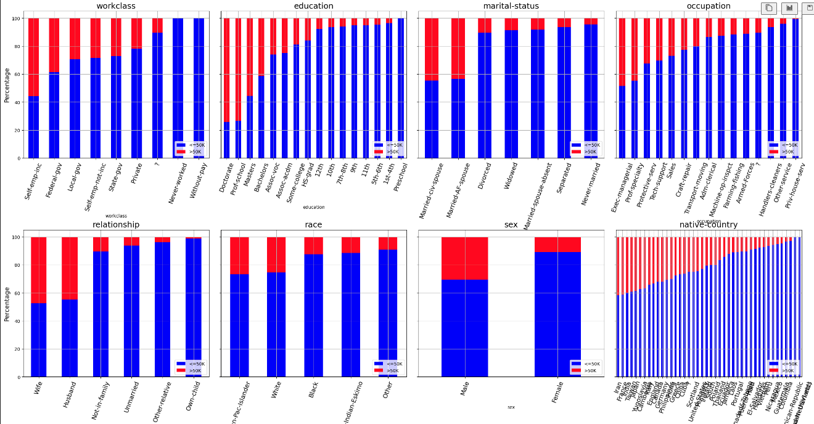
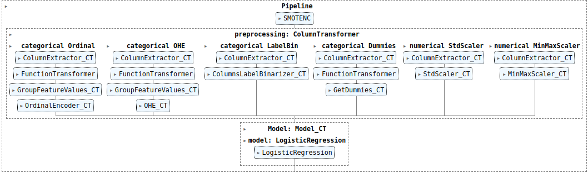
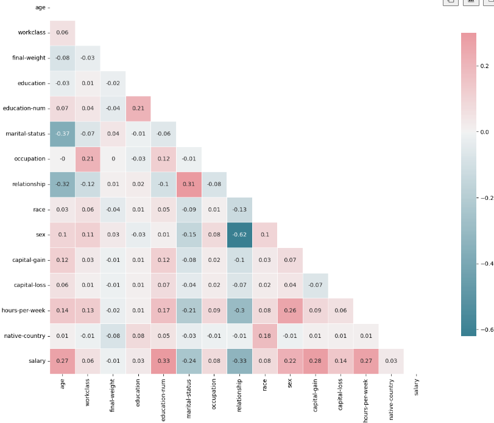
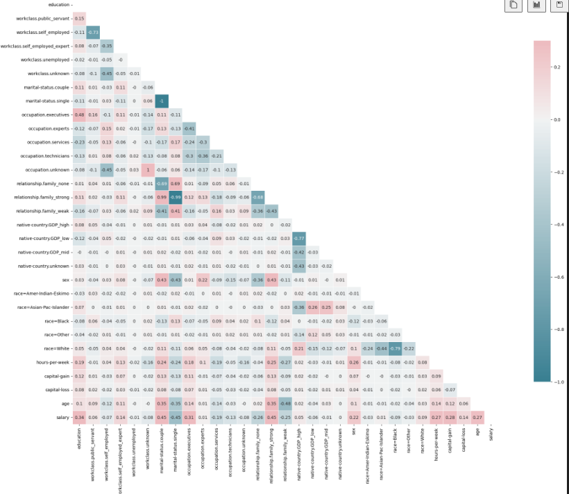
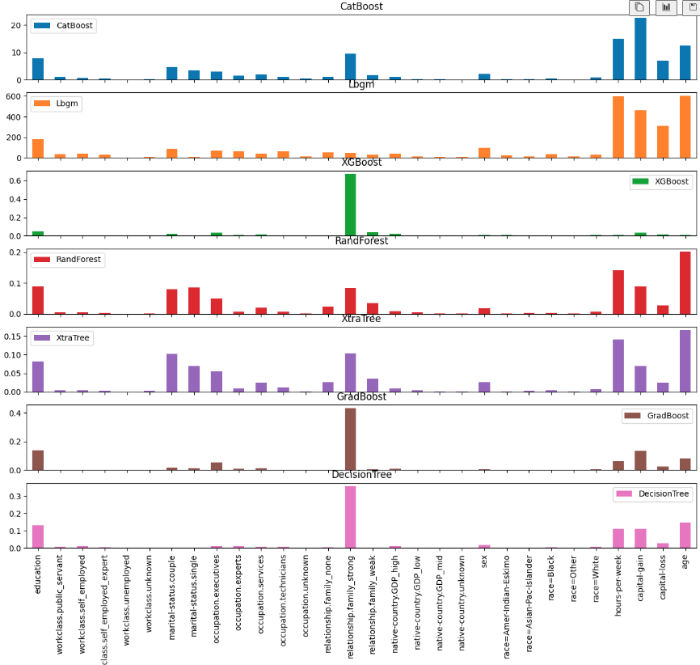
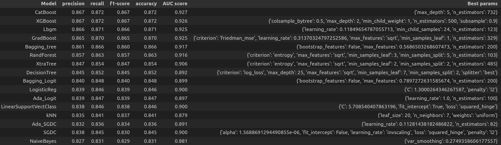

# FHNW Data Science specialization module
## Advanced Machine Learning techniques for imbalanced datasets
=======

## Project requirements:
- Develop a classifier for the adult census dataset using advanced machine learning techniques

### Dataset:
- https://archive.ics.uci.edu/ml/datasets/Adult

### Getting started:
- Install a virtual environment:
```sh
virtualenv -p /usr/bin/python3.10 venv
```
- Activate virtual environment:
```sh
source venv/bin/activate
```
- Install python libraries:
```sh
pip install -r requirements.txt
```
- Clone the repository:
```sh
git clone git@github.com:olivier-2018/Adv_ML_techniques_for_imbalanced_dataset.git
# then
cd Adv_ML_techniques_for_imbalanced_dataset
```
- Run the jupyter notebook using your favorite IDE.


## Results overview:

### Data exploration - Numerical features


### Data exploration - Categorical features


### Pipeline & customer transformers


### Raw features cross-correlation


### Transformed features cross-correlation


### Feature importance


### Final classification


### Precision-Recal & ROC_curves

